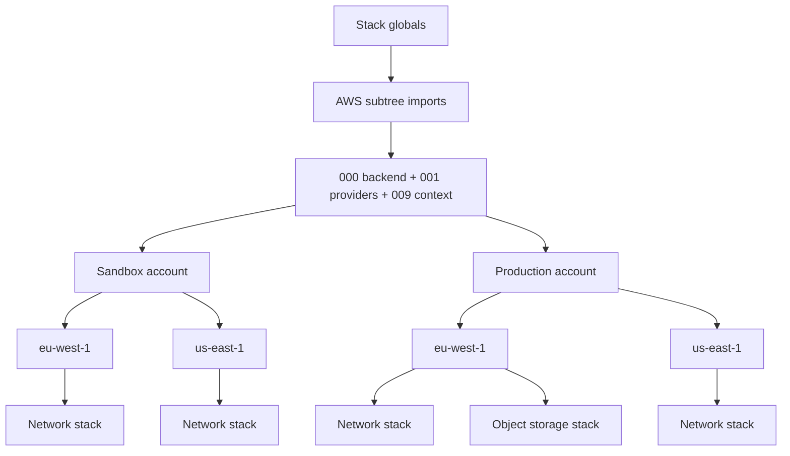

# Architecture

## Configuration flow



Terramate evaluates globals in the context of each stack. The same generator
therefore produces different concrete backend and provider files for each
account and region without copying configuration between stacks.

## Accounts and state

| Scope | Dummy account ID | Local profile | State buckets |
| --- | --- | --- | --- |
| Sandbox | `111111111111` | `example-sandbox` | `tf-state-euw1-111111111111`, `tf-state-use1-111111111111` |
| Production | `222222222222` | `example-production` | `tf-state-euw1-222222222222`, `tf-state-use1-222222222222` |
| Audit | `333333333333` | `example-audit` | Not used by a sample stack |

Every state key uses the immutable stack ID:

```text
terraform/stacks/by-id/<stack-id>/terraform.tfstate
```

This keeps the state address stable if a stack directory is renamed or moved.
The backend generator derives S3 bucket and DynamoDB lock-table names from the
account and region. They must be bootstrapped before the stacks that consume
them.

## Provider model

Every AWS stack receives the default provider. The object-storage stack adds
two aliases:

| Address | Purpose |
| --- | --- |
| `aws` | Target account in the stack's directory region |
| `aws.secondary` | Same account in the paired region |
| `aws.audit` | Central audit account through a separate AWS profile |

The object-storage stack passes these aliases explicitly to three module
instances. This shows the provider-routing pattern without coupling provider
blocks to reusable modules.

`001_providers.tm.hcl` retains the provider-map and alias-generation pattern,
while keeping provider authentication out of the framework. AWS is the only
provider with special handling because its generated block receives default
tags.

Individual stacks can opt into arbitrary additional providers. For example,
the object-storage stack declares both `random` and `time`:

```hcl
globals "terraform" "providers" "random" {
  enabled = true
  source  = "hashicorp/random"
  version = "~> 3.0"
  config  = {}
}

globals "terraform" "providers" "time" {
  enabled = true
  source  = "hashicorp/time"
  version = "~> 0.13"
  config  = {}
}
```

These entries generate the required-provider declarations and provider blocks
only for that stack. The Random provider produces an unrelated example label;
it is not used to construct state or resource bucket names.

## Adding a stack

For an AWS stack, choose its account and region directory, then create it:

```shell
cd stacks/aws/sandbox/eu-west-1
terramate create example-service
terramate generate
```

Add handwritten Terraform beside the generated files. Put reusable resources
in `modules/`; keep account, region, provider, and state defaults in the
Terramate hierarchy.

## Adapting the reference

Before real use:

1. Replace all dummy account IDs and AWS profiles.
2. Decide whether state is account-local or centralized and adjust the account
   globals accordingly.
3. Pin provider versions to the chosen upgrade policy.
4. Add CI checks for `terramate generate`, `terraform fmt`, validation, and
   plans for changed stacks.
5. Add policy checks and approval gates appropriate to the environment.
